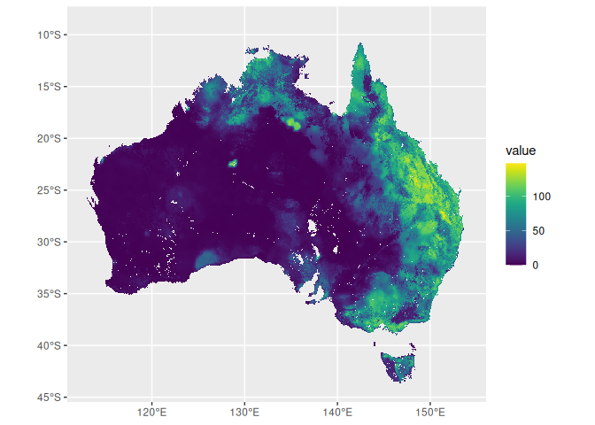

<!-- README.md is generated from README.Rmd. Please edit that file -->

# nert

<!-- badges: start -->

[](https://www.repostatus.org/#active)
[](https://github.com/AAGI-AUS/nert/actions/workflows/R-CMD-check.yaml)
[](https://app.codecov.io/gh/AAGI-AUS/nert)
<!-- badges: end -->

The {nert} package streamlines access to various Cloud-Optimised GeoTIFF
(COG) datasets provided by the Australian Terrestrial Ecosystem Research
Network (TERN), allowing you to easily incorporate these environmental
datasets into your R analytics. Currently supported datasets in the
{nert} package include:

- Daily volumetric soil moisture estimates from the Soil Moisture
  Integration and Prediction System (SMIPS),
- Actual evapotranspiration estimates using the CSIRO MODIS
  Reflectance-based Scaling EvapoTranspiration (CMRSET) algorithm,
- Soil orders from the Australian Soil Classification Map,
- Canopy height estimates from the OzTreeMap best-pick canopy height
  model,
- Australian land surface phenology based on thresholded MODIS Enhanced
  Vegetation Index (EVI) data,
- Soil and Landscape Grid of Australia (SLGA) datasets, including
  available volumetric water capacity, clay/sand/silt content, Bulk
  Density (whole earth) measurements, soil pH (CaCl2 and water),
  nitrogen and phosphorus content, cation exchange capacity, and the
  drained upper limit and 15-bar lower limit water content readings,
- Soil bacteria and soil fungi Beta Diversity datasets.

## Installation instructions

{nert} is available through the
[R-Universe](https://r-universe.dev/search) with pre-built binaries
(this is the easy way).

To get started:

### Enable this universe

``` r
options(
  repos = c(
    AAGI = "https://aagi-aus.r-universe.dev",
    CRAN = "https://cloud.r-project.org"
  )
)
```

### Install

``` r
install.packages("nert")
```

### The hard(er) way

Note that for Linux users, you will need to install system libraries to
support geospatial packages in R, *e.g.*, {sf} and {terra} as well as
some packages for downloading data via
[curl](https://curl.se/download.html), please see [Note for Linux
Installers](#Note-for-Linux-Installers). If you run into errors, *e.g.*,
`Bad GitHub Credentials`, please read this: [Managing Git(Hub)
Credentials](https://usethis.r-lib.org/articles/git-credentials.html)
and set up your GitHub credentials in R and try again.

You can install the development version of {nert} from
[GitHub](https://github.com/AAGI-AUS/nert) with:

``` r
o <- options() # store original options

options(pkg.build_vignettes = TRUE)

if (!require("pak")) {
  install.packages("pak")
}

pak::pak("AAGI-AUS/nert")
options(o) # reset options
```

## Example: reading a SMIPS COG as a spatial object

The {nert} package provides a number of convenient functions such as
`read_smips()` which allow you to fetch COGs from the TERN Data Portal
for use in your R session. The below code fetches the SMIPS soil
moisture raster for the 1st of January 2024, and then uses the {terra}
package’s `extract()` function to get a soil moisture estimate for the
Adelaide CBD. Note that since these are cloud-optimised COGs, they
employ Just-In-Time data streaming: that is, *only the bytes necessary
for the spatial extent we actually need are downloaded*, resulting in
significant time and disk-space savings.

``` r
library(nert)
library(terra)
#> terra 1.9.27

r <- read_smips(date = "2024-01-01")
extract(r, xy = TRUE, data.frame(lon = 138.6007, lat = -34.9285))
#>   ID smips_totalbucket_mm_20240101        x         y
#> 1  1                      46.07692 138.6037 -34.93254
```

The {nert} package also re-exports {tidyterra}’s `autoplot()` function,
which can be used to create a visualisation of the Australia-wide data
rasters.

``` r
autoplot(r)
#> <SpatRaster> resampled to 501270 cells.
```



## Extract Values in Bulk Given Lat/Lon Values

The {nert} package also provides a convenient function
`collect_tern_data()` which allows you to easily grab multiple TERN
datasets across multiple times and multiple spatial locations. For
example, the below code grabs the SMIPS “totalbucket” and SLGA “CLY”
clay content estimates at 0-5cm across the first week of 2024 at
Merriden, WA and Tamworth, NSW:

``` r
dat <- collect_tern_data(
  xy = data.frame(lon = c(118.28, 150.84), lat = c(-31.48, -31.07)),
  date_range = c("2024-01-01", "2024-01-07"),
  datasets = c("SMIPS", "CLY"),
  smips_collection = "totalbucket",
  depth = "000_005",
  verbose = FALSE
)
head(dat)
#>          date    lon    lat SMIPS_totalbucket   CLY
#>        <Date>  <num>  <num>             <num> <num>
#> 1: 2024-01-01 118.28 -31.48         0.2271653    11
#> 2: 2024-01-01 150.84 -31.07        93.4498901    28
#> 3: 2024-01-02 118.28 -31.48         0.2135102    11
#> 4: 2024-01-02 150.84 -31.07        90.6175690    28
#> 5: 2024-01-03 118.28 -31.48         0.2344290    11
#> 6: 2024-01-03 150.84 -31.07        88.5260391    28
```

## Keeping {nert} Updated

{nert} is undergoing active development and is not yet on CRAN. If you
installed {nert} using the R-Universe (the preferred method), you can
keep {nert} up-to-date locally like so:

``` r
update.packages()
```

and answering `yes` or `y` when asked if you would like to upgrade
{nert}.

## Note for Linux Installers

If you are using Linux, you will likely need to install several
system-level libraries, {pak} will do it’s best to install most of them
but some may not be installable this way. For
[Nectar](https://ardc.edu.au/services/ardc-nectar-research-cloud/) with
a fresh Ubuntu image, you can use the following command to install
system libraries to install {pak} and then install {fifo}. In your Linux
terminal (not your R console, the “terminal” tab in RStudio should do
here in most cases) type:

``` bash
sudo apt update && sudo apt install libcurl4-openssl-dev libgdal-dev gdal-bin libgeos-dev libproj-dev libsqlite3-dev libudunits2-dev libxml2-dev
```

## Development

### Dev Container

Set up the container.

``` bash
devcontainer up --workspace-folder .
```

Run tests and check stuff.

``` bash
devcontainer exec --workspace-folder . R -e "devtools::check()"
```

Render this file.

``` bash
devcontainer exec --workspace-folder . R -e "devtools::build_readme()"
```

## Citing {nert}

To cite nert:

``` r
citation("nert")
#> To cite package 'nert' in publications use:
#> 
#>   Sparks AH, Pipattungsakul W, Edson R, Rogers S, Moldovan M (2026).
#>   nert: An API Client for TERN Data. R package version 1.1.0.
#>   https://aagi-aus.github.io/nert/
#> 
#> A BibTeX entry for LaTeX users is
#> 
#>   @Manual{,
#>     title = {{nert}: An API Client for TERN Data},
#>     author = {Adam H. Sparks and Wasin Pipattungsakul and Russell Edson and Sam Rogers and Max Moldovan},
#>     year = {2026},
#>     note = {R package version 1.1.0},
#>     url = {https://aagi-aus.github.io/nert/},
#>   }
```
