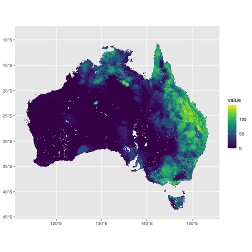

<!-- README.md is generated from README.Rmd. Please edit that file -->


# nert

<!-- badges: start -->
[](https://github.com/AAGI-AUS/nert/actions/workflows/R-CMD-check.yaml)
[](https://app.codecov.io/gh/AAGI-AUS/nert)
<!-- badges: end -->

The goal of {nert} is to provide access to Australian TERN (Terrestrial Ecosystem Research Network) data in your R session.

## Installation

You can install the development version of {nert} from [GitHub](https://github.com/AAGI-AUS/nert) with:


``` r
if (!require("pak")) {
  install.packages("pak")
}

pak::pak("AAGI-AUS/nert")
```

## Example: reading a COG as a spatial object

This is a basic example which shows you how you can fetch one day's data from the SMIPS data (currently the only supported data set in TERN) and visualise it:


``` r
library(nert)
#> 
#> Attaching package: 'nert'
#> The following object is masked from 'package:graphics':
#> 
#>     plot
#> The following object is masked from 'package:base':
#> 
#>     plot
r <- read_cog(day = "2024-01-01")

plot(r)
```

<div class="figure">

<p class="caption">plot of chunk example_cog</p>
</div>

## Extract Values Given Lat/Lon Values

Extract Soil Moisture for Corrigin and Merriden, WA and Tamworth, NSW given latitude and longitude values for each.


``` r
libary(terra)
#> Error in libary(terra): could not find function "libary"
df <- structure(
  list(
    location = c("Corrigin", "Merredin", "Tamworth"),
    x = c(117.87, 118.28, 150.84),
    y = c(-32.33, -31.48, -31.07)
  ),
  row.names = c(NA, -3L),
  class = "data.frame"
)

cog_df <- extract(x = r, y = df[, c("x", "y")], xy = TRUE)
#> Error in extract(x = r, y = df[, c("x", "y")], xy = TRUE): could not find function "extract"

cog_df <- cbind(df$location, cog_df)
#> Error: object 'cog_df' not found
names(cog_df) <- c("location", "ID", "smips_totalbucket_mm_20240101", "x", "y")
#> Error: object 'cog_df' not found
cog_df
#> Error: object 'cog_df' not found
```
