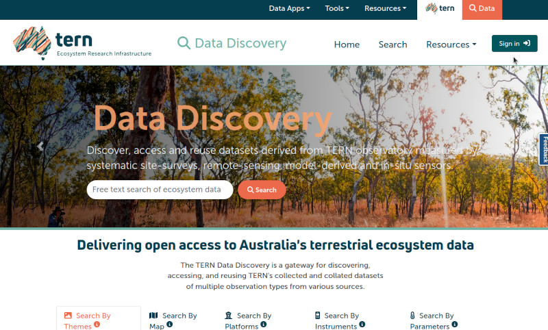
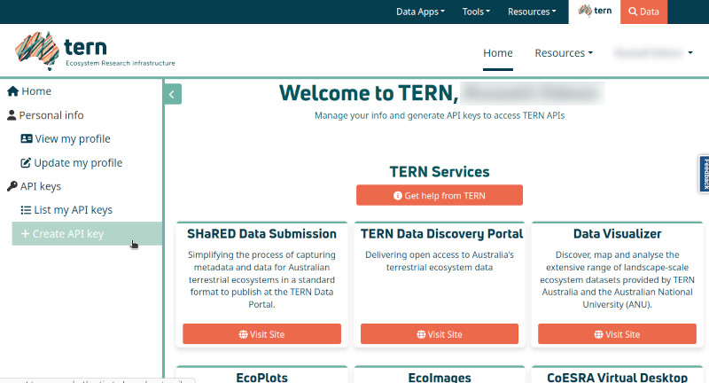
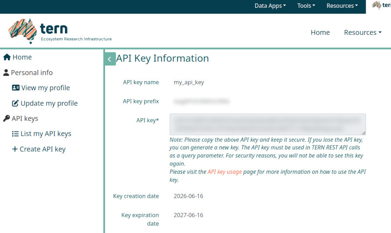

# nert

The Australian Terrestrial Ecological Research Network (TERN) offers
several data sets as Cloud Optimised Geotiff (COG) files. The Soil
Moisture Integration and Prediction System (SMIPS) generates useful
measurements of soil moisture at 1km resolution across all of Australia
and the Australian Soil Classification map (ASC) provides modelled soil
class data at a resolution of 90m. TERN provides these data as packaged
daily datasets [via their TERN Data
Portal](https://portal.tern.org.au/results). The {nert} package provides
ease of access to these datasets for use and inclusion in R data
analytics workflows. This can be obtained by registering at
<https://portal.tern.org.au>, or by more simply using
[`nert::get_key()`](https://aagi-aus.github.io/nert/reference/get_key.md)
in your R session. This document introduces you to the {nert} package,
including setup and how to use the package to download data from TERN.

## Acquiring Your TERN API Key

An API key is required to access TERN datasets (including SMIPS) through
their online data portal. The {nert} package streamlines the data
process, but still requires authorisation using an API key. However, it
is straightforward to sign up to the TERN Data Portal and acquire an API
key that you can use, and by setting it in your R environment (via
`.Renviron`) you can provide the {nert} package with that credential to
allow convenient access.

The following steps detail the process for signing in to your TERN
account, generating an API key, and storing it in your R environment.

1.  Either directly navigate to the TERN Data Discovery Portal
    (<https://portal.tern.org.au/>) in a web browser OR use
    [`nert::get_key()`](https://aagi-aus.github.io/nert/reference/get_key.md)
    to launch a web browser at the TERN website and click the “Sign In”
    button that appears in the top-right of the browser window.

``` r
library(nert)
get_key()
```



2.  Click the Australian Access Federation button to sign in to the TERN
    Data Portal via your University ID (or alternatively, sign in via
    CILogon or your Google identity).

    

3.  Once signed in, click on the menu in the top-right with your name
    and click the “TERN Account” entry to open your account profile.

    

4.  On your account profile screen, navigate to the menu on the
    left-hand side, and click the “Create API key” entry.

    

5.  On this screen you can create your API key for accessing the TERN
    Data Portal. Give your key whatever name you like (e.g., below I
    have called the key “my_API_key” for demonstration purposes), and
    then click the “Request API Key” button.

    

6.  Your API key is now generated and appears as the string of text
    inside the text box on the page, together with the key’s creation
    and expiration dates. Copy the API key to your clipboard, be sure
    not to close this browser window until after you have successfully
    stored the key locally somewhere as you won’t see it again.

    

## Saving Your API Key Locally

### Using Your .Renviron File

There are a few options for saving your key locally. The most
straightforward way is to save it directly into your `.Renviron` file.
The most secure way is to store it in your system’s keychain using the
[{keyring}](https://keyring.r-lib.org/index.html) package.

Following, I will demonstrate how to save your API key in your
`.Renviron` file and also, optionally, your operating system’s
credentials store for more security.

1.  Open your `.Renviron` file. An easy way to open the right file is to
    use the {usethis} package in your R session, *e.g.*,
    [`usethis::edit_r_environ()`](https://usethis.r-lib.org/reference/edit.html).
    Add a new line to the file to store your API key in the variable
    `TERN_API_KEY`, ensuring to use that name as that is what {nert}
    will automatically look for:

``` bash
    TERN_API_KEY='<paste your key here>'
```

    {width=80%}

2.  Save your `.Renviron` file, and restart your R session so that the
    change is applied. You can then test that the {nert} package is
    reading your API key properly by entering
    [`nert::get_key()`](https://aagi-aus.github.io/nert/reference/get_key.md)
    at the R command console. If the API key was successfully read by
    {nert}, then you should see your API key appear verbatim as output.

    

3.  Finally, you can quickly test that the data download from the TERN
    portal is working as intended by downloading a test data raster. The
    below code downloads the SMIPS “totalbucket” soil moisture data
    raster for January 1st, 2024, and uses the {terra} package’s
    [`terra::extract()`](https://rspatial.github.io/terra/reference/extract.html)
    function to get a point value for the soil moisture measurement at
    the Adelaide CBD (at approximately -34.9285 decimal degrees
    latitude, 138.6007 longitude):

``` r
library(nert)
library(terra)
#> terra 1.8.54
#> 
#> Attaching package: 'terra'
#> The following object is masked from 'package:knitr':
#> 
#>     spin

r <- read_smips(day = "2024-01-01")

extract(r, xy = TRUE, data.frame(lon = 138.6007, lat = -34.9285))
#>   ID smips_totalbucket_mm_20240101        x         y
#> 1  1                      46.07692 138.6037 -34.93254
```

At this stage your {nert} package is now working, and you can use it to
easily download SMIPS datasets from the TERN Data Portal.

### Using the {keyring} Package for Secure Storage

If you prefer a more secure method, you can use the
[{keyring}](https://keyring.r-lib.org/index.html) package to store your
API key in your system’s credential store. If you don’t have the
{keyring} package installed, you can install it with:

``` r
install.packages("keyring")
```

Once it’s installed, you can store your API key with:

``` r
library(keyring)

keyring_create("nert")

# add the key to your OS's credential store
key_set("NERT_API_KEY", keyring = "nert")

# verify that the key was stored properly
key_get("NERT_API_KEY", keyring = "nert")
```

Where `NERT_API_KEY` is the name of the key you want to store in the
keyring. You will enter the actual key value you copied from the TERN
website when {keyring} prompts you to do so.

``` r
library(nert)
library(keyring)

r <- read_smips(
  day = "2024-01-01",
  api_key = key_get("NERT_API_KEY", keyring = "nert")
)
```

Note that here we specified a value for the API key.

### Reading TERN Data

Using the example from above, you can get the SMIPS data for all of
Australia on Jan 1, 2024 like so:

``` r
library(nert)
r <- read_smips(day = "2024-01-01")
```

Note that {nert} re-exports
[`tidyterra::autoplot`](https://ggplot2.tidyverse.org/reference/autoplot.html)
for ease of visualalising the TERN data.

``` r
autoplot(r)
#> <SpatRaster> resampled to 501270 cells.
```


A plot of SMIPS data for all of Australia on 2024-01-01.

Repeating an example from above where we tested if the API key works, if
you wish to fetch only data for a single point or points, you can
specify them like this using the data object, `r`, from above, which is
much quicker than fetching the entire dataset:

``` r
library(terra)

extract(r, xy = TRUE, data.frame(lon = 138.6007, lat = -34.9285))
#>   ID smips_totalbucket_mm_20240101        x         y
#> 1  1                      46.07692 138.6037 -34.93254
```

Reading the Australian Soils Classification data works in the same way.
To get the classification data you do not need to specify any arguments
for
[`read_asc()`](https://aagi-aus.github.io/nert/reference/read_asc.md).

``` r
asc <- read_asc()

autoplot(asc)
#> <SpatRaster> resampled to 500388 cells.
```


A plot of Australian Soils Classification data.

If you would like to work with the Confusion Index, which supplies an
estimate of the level of certainty in the model predictions where 1 is
high confusion and 0 is low confusion, you can specify the
`confusion_index = TRUE` argument like so.

``` r
asc_ci <- read_asc(confusion_index = TRUE)
```

That’s it, you’re all set!
