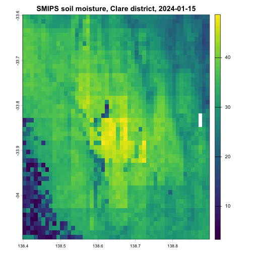

<!-- STOP! Do not edit this file. This file is generated from bandwidth_safe_subsetting.Rmd.orig -->


The TERN datasets that {nert} reads are national-extent rasters served as Cloud Optimised GeoTIFF (COG) files. Most analyses only need a small window of that extent, such as a paddock or a farm. This vignette shows how to work with {nert} so that only the window you need is actually queried rather than downloading the whole continent.

If you have not set up your TERN API key yet, see the *nert* vignette first.


``` r
library(nert)
library(terra)
```

## COGs are lazy until you touch the values

A call to `read_tern()`, or any of the `read_*()` wrappers, does not download the dataset. It returns a `SpatRaster` that points at the remote COG, and building that object only fetches the file's metadata (its extent, resolution, coordinate reference system and tiling). The pixel values stay on the TERN server.

Data starts moving when you do something that needs the values, calling `plot()`, `writeRaster()`, `values()`, `extract()`, or using the raster in a computation. The COG format lets you download only the data you actually ask for, rather than the whole file, so the amount downloaded is decided by what you request, not by the size of the dataset.

## Look before you pull

The cell count of a lazy raster tells you what a careless call would cost. Here is the Soil and Landscape Grid of Australia (SLGA) clay content product, a static 90 m national grid. By default, `read_slga("CLY")` returns the estimated value (EV) of clay content (%) for the 0-5 cm depth layer.


``` r
clay <- read_slga("CLY")
dim(clay)
#> [1] 40800 49200     1
ncell(clay)
#> [1] 2007360000
```

The file behind this single layer is about 651 MB on the TERN server, and if you need all of the raster values you will download essentially the entire raster. Checking `ncell()` and `dim()` on any freshly created raster is a cheap habit that will save you from the expensive mistake.

## Crop to an area of interest first

The bandwidth-safe pattern has two steps. Define your area of interest as an extent, and `crop()` before you plot, extract or compute.

Here is daily soil moisture from SMIPS for a single day, cropped to a block of cropping country around Clare in South Australia's mid-north. The extent is given in longitude-latitude, which is what SMIPS and almost all other {nert} datasets use (more on the one exception below).


``` r
smips <- read_smips(date = "2024-01-15")

aoi <- ext(138.4, 138.9, -34.1, -33.6)
smips_clare <- crop(smips, aoi)
smips_clare
#> class       : SpatRaster 
#> size        : 50, 50, 1  (nrow, ncol, nlyr)
#> resolution  : 0.009997566, 0.009997122  (x, y)
#> extent      : 138.3988, 138.8987, -34.09778, -33.59792  (xmin, xmax, ymin, ymax)
#> coord. ref. : lon/lat WGS 84 (EPSG:4326) 
#> source(s)   : memory
#> varname     : smips_totalbucket_mm_20240115 
#> name        : smips_totalbucket_mm_20240115 
#> min value   :                      3.287303 
#> max value   :                     48.746872
```

The crop is where the download happens, and it only fetches the tiles that intersect the area of interest. Compare the cell counts to see what stayed on the server.


``` r
ncell(smips)
#> [1] 14278140
ncell(smips_clare)
#> [1] 2500
round(ncell(smips) / ncell(smips_clare))
#> [1] 5711
```

Plotting the cropped object is now a local, instant operation.


``` r
plot(smips_clare, main = "SMIPS soil moisture, Clare district, 2024-01-15")
```

<div class="figure" style="text-align: center">

<p class="caption">plot of chunk smips-clare-plot</p>
</div>

`terra` also offers `window()`, which restricts a raster to an extent without creating a copy, and `mask()` for non-rectangular boundaries such as a paddock polygon. Both compose with the same pattern, narrow first, then touch the values.

## Extracting at points is already bandwidth-safe

If you want values at sampling sites rather than a map, you do not need to crop at all. `extract()` on the lazy raster reads only the pixels under your points, and it accepts a two-column data frame of longitude-latitude coordinates directly, there is no need to build a spatial object first.


``` r
sites <- data.frame(
  site = c("north", "home", "creek"),
  lon = c(138.55, 138.62, 138.70),
  lat = c(-33.75, -33.82, -33.95)
)

extract(clay, sites[, c("lon", "lat")])
#>   ID CLY_000_005_EV_N_P_AU_TRN_N_20210902
#> 1  1                                   20
#> 2  2                                   17
#> 3  3                                   21
```

This is the cheapest way to use the national grids in a field-trial or survey workflow, a handful of pixels crosses the network instead of a continent.

## Mind the coordinate reference system

Every {nert} dataset is served in longitude-latitude except one. The canopy height composite uses the projected GDA94 Australian Albers system (EPSG:3577), with coordinates in metres rather than degrees.


``` r
canopy <- read_canopy_height()
crs(canopy, describe = TRUE)$code
#> [1] "3577"
```

What this means in practice depends on the operation. `extract()` converts for you, longitude-latitude points work directly and terra prints a message that it is transforming them to the raster's system.


``` r
extract(canopy, sites[, c("lon", "lat")])
#> Warning: [extract] transforming vector data to the CRS of the raster
#>   ID best_pick_files_bhLNnun
#> 1  1                       0
#> 2  2                       0
#> 3  3                       0
```

`crop()` does not convert. An extent in degrees does not overlap an extent in metres, so cropping the canopy raster fails with a non-overlapping extents error unless the area of interest is projected first. `project()` re-expresses the same rectangle in the raster's own coordinate system.


``` r
aoi_albers <- project(vect(aoi, crs = "EPSG:4326"), crs(canopy))
canopy_clare <- crop(canopy, aoi_albers)
canopy_clare
#> class       : SpatRaster 
#> size        : 1936, 1628, 1  (nrow, ncol, nlyr)
#> resolution  : 30, 30  (x, y)
#> extent      : 587393.3, 636233.3, -3738994, -3680914  (xmin, xmax, ymin, ymax)
#> coord. ref. : GDA94 / Australian Albers (EPSG:3577) 
#> source(s)   : memory
#> varname     : best_pick_files_bhLNnun 
#> name        : best_pick_files_bhLNnun 
#> min value   :                       0 
#> max value   :                      61
```

The canopy height composite is the only dataset where this step is needed. For everything else, extents in plain longitude-latitude are already in the raster's system.

## Save the crop, then work offline

For anything beyond a quick look, write the cropped raster to disk once and point the rest of your analysis at the local file. Repeated model runs then cost no bandwidth at all.


``` r
local_tif <- file.path(tempdir(), "smips_clare_2024-01-15.tif")
writeRaster(smips_clare, local_tif, overwrite = TRUE)
smips_local <- rast(local_tif)
smips_local
#> class       : SpatRaster 
#> size        : 50, 50, 1  (nrow, ncol, nlyr)
#> resolution  : 0.009997566, 0.009997122  (x, y)
#> extent      : 138.3988, 138.8987, -34.09778, -33.59792  (xmin, xmax, ymin, ymax)
#> coord. ref. : lon/lat WGS 84 (EPSG:4326) 
#> source      : smips_clare_2024-01-15.tif 
#> name        : smips_totalbucket_mm_20240115 
#> min value   :                      3.287303 
#> max value   :                     48.746872
```
