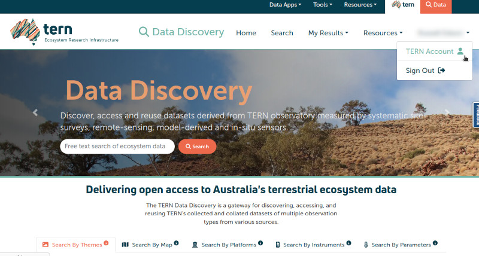
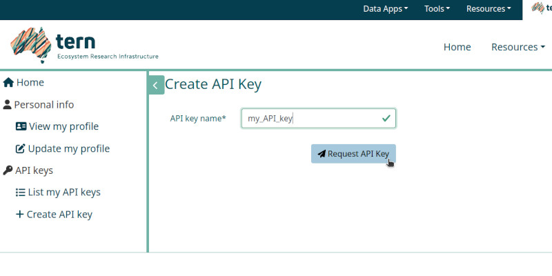
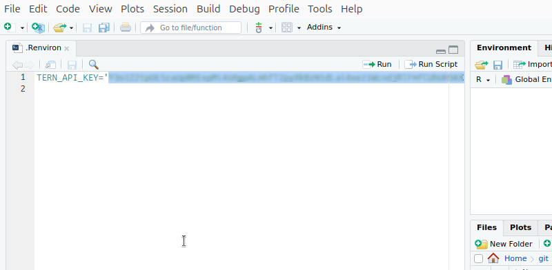
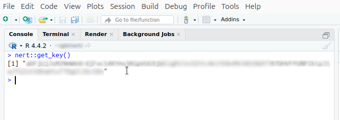
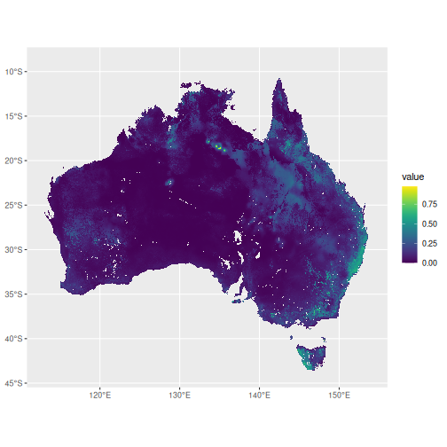
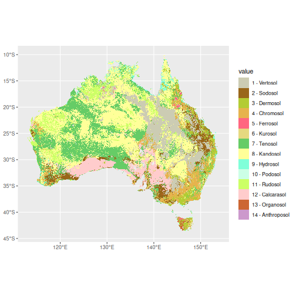
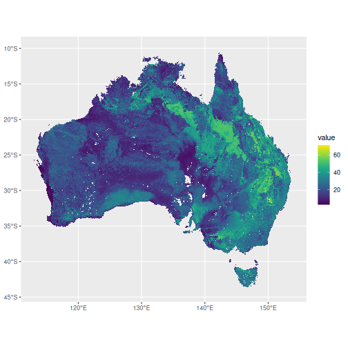

<!-- STOP! Do not edit this file. This file is generated from nert.Rmd.orig -->

The Australian Terrestrial Ecosystem Research Network (TERN) offers many datasets as Cloud Optimised GeoTIFF (COG) files via the [TERN Data Portal](https://portal.tern.org.au). The {nert} package provides an easy and straightforward way to retrieve these datasets for use in R data analytics workflows. Datasets currently available using {nert} are:

- Daily volumetric soil moisture measurements, from the TERN Soil Moisture Integration and Prediction System (SMIPS),
- the Australian Soil Classification Map,
- Actual Evapotranspiration measurements, estimated using the CSIRO MODIS Reflectance-based Scaling EvapoTranspiration (CMRSET) algorithm,
- canopy height data from the OzTreeMap best-pick Canopy Height composite model,
- Australian land surface phenology data,
- digital soil attributes from the *Soil and Landscape Grid of Australia* (SLGA), including available volumetric water capacity, clay/sand/silt content, Bulk Density (whole earth) measurements, soil pH (CaCl2 and water), nitrogen and phosphorus content, cation exchange capacity, and the drained upper limit and 15-bar lower limit water content readings,
- soil bacteria and soil fungi beta diversity.

The {nert} package uses your registered TERN API Key to authenticate with the TERN Data Portal. This vignette introduces you to the {nert} package, including how to obtain an API key and how to use {nert} to download TERN COG datasets.

## Acquiring Your TERN API Key

An API key is required to authenticate and access TERN datasets through the TERN Data Portal. It is straightforward to sign up to TERN and acquire an API key, and by setting the key in your R environment (via `.Renviron` or {keyring}) you can provide the {nert} package with that credential to allow convenient access whenever you use the package to download TERN datasets.

The following steps detail the process for signing in to your TERN account, generating an API key, and storing it in your R environment.

1.  Navigate to the TERN Data Discovery Portal (<https://portal.tern.org.au/>) in a web browser. (Alternatively, use `nert::get_key()` to open the TERN website in a web browser.) Click the "Sign In" button that appears in the top-right of the browser window.

    ``` r
    library(nert)
    get_key()
    ```

    {width="80%"}

2.  Click the Australian Access Federation button to sign in to the TERN Data Portal via your University ID (or alternatively, sign in via CILogon or your Google identity).

    {width="80%"}

3.  Once signed in, click on the menu in the top-right with your name and click the "TERN Account" entry to open your account profile.

    {width="80%"}

4.  On your account profile screen, navigate to the menu on the left-hand side, and click the "Create API key" entry.

    {width="80%"}

5.  On this screen you can create your API key for accessing the TERN Data Portal. Give your key whatever name you like (e.g., below I have called the key "my_API_key" for demonstration purposes), and then click the "Request API Key" button.

    {width="80%"}

6.  Your API key is now generated and appears as the string of text inside the text box on the page, together with the key's creation and expiration dates. Copy the API key to your clipboard, be sure not to close this browser window until after you have successfully stored the key locally somewhere as you won't see it again.

    {width="80%"}

## Saving Your API Key Locally

There are a couple of options for saving your key locally so that it is available for the {nert} package to use. The most straightforward way is to save it directly into your `.Renviron` file so that it is available in your R session upon each load. Alternatively, the API key can be stored in your operating system's keychain credential store using the [{keyring}](https://keyring.r-lib.org/index.html) package for extra security. Both methods are explained below.

### Using Your .Renviron File

You can store the TERN API Key in your `.Renviron` file as follows:

1.  Open your `.Renviron` file. (An easy way to open this file is to use the {usethis} package in your R session, *e.g.*, `usethis::edit_r_environ()`.) In your `.Renviron` file, add a new line to set a variable called `TERN_API_KEY`, and paste in the API key you copied earlier as the value for the variable. Note that this is the variable that the {nert} package automatically looks for during the authentication, so be sure to double-check that the spelling and case are correct for the variable name.

    ``` bash
    TERN_API_KEY='<paste your key here>'
    ```

    {width="80%"}

2.  Save your `.Renviron` file, and restart your R session so that the change is applied. Once you have restarted your R session, you can then test that the {nert} package is reading your API key properly by running `nert::get_key()` at the R command console. If the API key was successfully read by {nert}, then you should see your API key appear verbatim as output.

    {width="80%"}

3.  Finally, you can quickly test that the data download from the TERN Data Portal is working correctly by downloading a data raster. The below R code retrieves the SMIPS "totalbucket" soil moisture data raster for January 1st, 2024 using the `nert::read_smips()` function, and then uses the {terra} package's `terra::extract()` function to get a point value for the soil moisture measurement at the Adelaide CBD (at approximately 138.6007 decimal degrees Easting for the longitude, and -34.9285 decimal degrees Northing for the latitude):

    ``` r
    library(nert)
    library(terra)

    r <- read_smips(date = "2024-01-01")

    extract(r, xy = TRUE, data.frame(lon = 138.6007, lat = -34.9285))
    #>   ID smips_totalbucket_mm_20240101        x         y
    #> 1  1                      46.07692 138.6037 -34.93254
    ```

At this stage your {nert} package is now working, and you can use it to easily download COG data from the TERN Data Portal.

### Using the {keyring} Package for Secure Storage

If you prefer a more secure method, you can use the [{keyring}](https://keyring.r-lib.org/index.html) package to store your TERN API Key in your system's credential store.

1.  If you don't have the {keyring} package installed, you can install it with:

    ``` r
    install.packages("keyring")
    ```

2.  Once {keyring} is installed, you can store your API key using the `keyring::keyring_create()` and `keyring::key_set()` functions as follows:

    ``` r
    library(keyring)

    keyring_create("nert")
    key_set("NERT_API_KEY", keyring = "nert")
    ```

    This will create a new keyring called `nert`, with a new key called `NERT_API_KEY`. The function will then prompt you for the actual key value, which you can paste from the TERN website where you copied it earlier. You can then verify that the key was stored as expected by using the `keyring::key_get()` function:

    ``` r
    key_get("NERT_API_KEY", keyring = "nert")
    ```

3.  Finally, you can quickly check that the TERN API key is working with the {nert} package correctly by trying to download a raster. The below R code retrieves the SMIPS "totalbucket" soil moisture data raster for January 1st, 2024 using the `nert::read_smips()` function, and then uses the {terra} package's `terra::extract()` function to get a point value for the soil moisture measurement at the Adelaide CBD (at approximately 138.6007 decimal degrees Easting for the longitude, and -34.9285 decimal degrees Northing for the latitude). Note that we explicitly specify to use the `NERT_API_KEY` we stored in the `nert` keyring by setting the `api_key` argument:

    ``` r
    library(nert)
    library(keyring)

    r <- read_smips(
      date = "2024-01-01",
      api_key = key_get("NERT_API_KEY", keyring = "nert")
    )

    extract(r, xy = TRUE, data.frame(lon = 138.6007, lat = -34.9285))
    ```

### Reading TERN Data

You can use the `nert::read_smips()` function to retrieve rasters for the SMIPS datasets available on the TERN Data Portal, using the `date` argument to specify the date for the raster to be retrieved, and the `collection` argument to specify which specific SMIPS dataset to download. For instance, the following R code retrieves the "SMindex" raster for June 30, 2025:

``` r
library(nert)
r <- read_smips(date = "2025-06-30", collection = "SMindex")
```

Note that {nert} re-exports `tidyterra::autoplot()` for ease of visualising the TERN data.

``` r
autoplot(r)
#> <SpatRaster> resampled to 501270 cells.
```

::: {.figure style="text-align: center"}


<p class="caption">

A plot of SMIPS SMindex data for all of Australia on 2025-06-30.

</p>
:::

However, if you wish to fetch only data for a single point or points, you can use the `terra::extract()` function. Since the rasters are stored on the TERN Data Portal as Cloud-Optimised GeoTIFFs (COGs), `terra::extract()` is very time- and space-efficient, streaming only the bytes needed for the spatial extent that you ask for. The below R code downloads only the data at the coordinates specified, rather than fetching the entire dataset:

``` r
library(terra)

extract(r, xy = TRUE, data.frame(lon = 138.6007, lat = -34.9285))
#>   ID smips_smi_perc_20250630        x         y
#> 1  1               0.1554503 138.6037 -34.93254
```

Reading rasters for the other available datasets works mostly the same way. For example, the below R code retrieves the raster for the Australian Soil Classification Map using the `nert::read_asc()` function. Since this is a static dataset, you do not need to specify a date. By default, the soil classifications are retrieved:

``` r
asc <- read_asc()

autoplot(asc)
#> <SpatRaster> resampled to 500388 cells.
```

::: {.figure style="text-align: center"}


<p class="caption">

A plot of Australian Soils Classification data.

</p>
:::

If you wanted to see the confusion index instead (which provides a measure of the uncertainty associated with each classification), you can specify that dataset using the `collection` argument:

``` r
asc_ci <- read_asc(collection = "CI")
```

The SLGA soil attribute rasters work similarly, but have an additional depth parameter that you can specify. For instance, the following R code fetches and views the raster for the soil clay content at a depth of 30-60cm by specifying the `depth` argument:

``` r
cly <- read_slga("CLY", depth = "030_060")

autoplot(cly)
#> <SpatRaster> resampled to 500388 cells.
```

::: {.figure style="text-align: center"}


<p class="caption">

A plot of the soil clay content (%) at a 30-60cm soil depth.

</p>
:::

That's it, you're all set!
