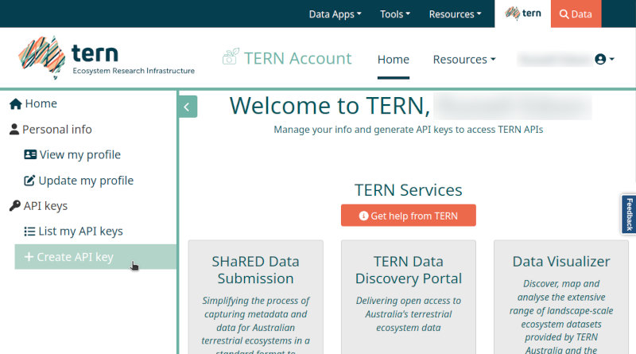

The TERN Soil Moisture Integration and Prediction System (SMIPS) generates useful measurements of soil moisture at 1km resolution across all of Australia.
TERN provides this soil moisture information as packaged daily datasets [via their TERN Data Portal](https://data.tern.org.au/model-derived/smips/), in cloud-optimised GeoTIFF format.
The {nert} package provides ease of access to these SMIPS datasets for use and inclusion in R data analytics workflows.
This can be obtained by registering at <https://portal.tern.org.au>, or by more simply using `nert::get_key()` in your R session.
This document introduces you to the {nert} package, including setup and how to use the package to download SMIPS data.

## Acquiring Your TERN API Key

An API key is required to access TERN datasets (including SMIPS) through their online data portal.
The {nert} package streamlines the data process, but still requires authorisation using an API key.
However, it is straightforward to sign up to the TERN Data Portal and acquire an API key that you can use, and by setting it in your R environment (via `.Renviron`) you can provide the {nert} package with that credential to allow convenient access.

The following steps detail the process for signing in to your TERN account, generating an API key, and storing it in your R environment.

1. Either directly navigate to the TERN Data Discovery Portal (<https://portal.tern.org.au/>) in a web browser OR use `nert::get_key()` to launch a web browser at the TERN website and click the "Sign In" button that appears in the top-right of the browser window.


``` r
library(nert)
get_key()
```
  {width=80%}

2. Click the Australian Access Federation button to sign in to the TERN Data Portal via your University ID (or alternatively, sign in via CILogon or your Google identity).

    {width=80%}

3. Once signed in, click on the menu in the top-right with your name and click the "TERN Account" entry to open your account profile.

    {width=80%}

4. On your account profile screen, navigate to the menu on the left-hand side, and click the "Create API key" entry.

    {width=80%}

5. On this screen you can create your API key for accessing the TERN Data Portal.
Give your key whatever name you like (e.g., below I have called the key "my_API_key" for demonstration purposes), and then click the "Request API Key" button.

    {width=80%}

6. Your API key is now generated and appears as the string of text inside the text box on the page, together with the key's creation and expiration dates.
Copy the API key to your clipboard, be sure not to close this browser window until after you have successfully stored the key locally somewhere as you won't see it again.

    {width=80%}

## Saving Your API Key Locally

### Using Your .Renviron File

There are a few options for saving your key locally.
The most straightforward way is to save it directly into your `.Renviron` file.
The most secure way is to store it in your system's keychain using the [{keyring}](https://keyring.r-lib.org/index.html) package.

Following, I will demonstrate how to save your API key in your `.Renviron` file and also, optionally, your operating system's credentials store for more security.

1. Open your `.Renviron` file.
An easy way to open the right file is to use the {usethis} package in your R session, _e.g._, `usethis::edit_r_environ()`.
Add a new line to the file to store your API key in the variable `TERN_API_KEY`, ensuring to use that name as that is what {nert} will automatically look for:

    ```
    TERN_API_KEY='<paste your key here>'
    ```

    {width=80%}

1. Save your `.Renviron` file, and restart your R session so that the change is applied.
You can then test that the {nert} package is reading your API key properly by entering `nert::get_key()` at the R command console.
If the API key was successfully read by {nert}, then you should see your API key appear verbatim as output.

    {width=80%}

1. Finally, you can quickly test that the data download from the TERN portal is working as intended by downloading a test data raster.
The below code downloads the SMIPS "totalbucket" soil moisture data raster for January 1st, 2024, and uses the {terra} package's `terra::extract()` function to get a point value for the soil moisture measurement at the Adelaide CBD (at
    approximately -34.9285 decimal degrees latitude, 138.6007 longitude):


``` r
library(nert)
library(terra)
#> terra 1.8.15
#> 
#> Attaching package: 'terra'
#> The following object is masked from 'package:knitr':
#> 
#>     spin

r <- read_smips(day = "2024-01-01")

extract(r, xy = TRUE, data.frame(lon = 138.6007, lat = -34.9285))
#>   ID smips_totalbucket_mm_20240101        x         y
#> 1  1                      46.07692 138.6037 -34.93254
```

At this stage your {nert} package is now working, and you can use it to easily download SMIPS datasets from the TERN Data Portal.

### Using the {keyring} Package for Secure Storage

If you prefer a more secure method, you can use the [{keyring}](https://keyring.r-lib.org/index.html) package to store your API key in your system's keychain.

If you don't have the {keyring} package installed, you can install it with:


``` r
=======
  %VignetteDepends{keyring}
<<<<<<< HEAD
---

```{r, include = FALSE}
knitr::opts_chunk$set(
  collapse = TRUE,
  comment = "#>"
)
```

To get started with {nert} you will need an API key from TERN.
This can be obtained by registering at <https://portal.tern.org.au>.
Once you have your API key, you can store it in your system's keychain using the [{keyring}](https://keyring.r-lib.org/index.html package.

We'll walk through this process in this vignette with screenshots to help you get set up.

First, load {nert} in your R session:

```{r setup, eval=FALSE}
library(nert)
```

Then, use the `r get_api_key()` function to get your API key from TERN.
This function will automatically laucnch your default broswer at the [TERN web page](https://www.tern.org.au).

First, on the landing page, click the "Login" button in the top right corner.


Second, choose your method for logging in.
You can use your AARNET institutional credentials, Google, or CILogon.


Next, click on "New API Key" in the left-hand menu.


Give the key a name and click "Request API Key".


Now you have your API key.
You won't be shown it again, so make sure to copy it to your clipboard and perhaps store it in your password manager or your local .Renviron file.
Alternatively, you can use the [{keyring}](https://keyring.r-lib.org/index.html) package to store it in your system's keychain.

## Saving Your API Key

### Using Your .Renviron File

To save your API key in your .Renviron file, open it with `usethis::edit_r_environ()` and add the following line:

```
TERN_API_KEY="your_api_key"
```

It is important to keep the name as "TERN_API_KEY" as this is what {nert} looks for when it loads your API key from the .Renviron file.
By default, {nert} will use the `get_api_key()` function to load your API key from the .Renviron file and you don't need to do anything else.
It's possible for you to just paste your API key directly into the `api_key` argument, but this is not recommended as it is less secure and you must do this every time you make a request from the API.

For example, you can use the following code to get data for Jan 1 2024:

```{r, default-example, eval=FALSE}
library(nert)
r <- get_smips(day = "2024-01-01")
```
Note that there is no API key specified here, as it is loaded from the .Renviron file automatically.

### Using the {keyring} Package

However, if you prefer a more secure method, you can use the {keyring} package to store your API key in your system's keychain.
If you don't have the {keyring} package installed, you can install it with:

```{r, keyring, eval=FALSE}
<<<<<<< HEAD
>>>>>>> 2accef4 (add getting-started)
=======
=======
  %VinetteDepends{terra}
  %VinetteDepends{usethis}
---


The TERN Soil Moisture Integration and Prediction System (SMIPS) generates useful measurements of soil moisture at 1km resolution across all of Australia.
TERN provides this soil moisture information as packaged daily datasets [via their TERN Data Portal](https://data.tern.org.au/model-derived/smips/), in cloud-optimised GeoTIFF format.
The {nert} package provides ease of access to these SMIPS datasets for use and inclusion in R data analytics workflows.
This can be obtained by registering at <https://portal.tern.org.au>, or by more simply using `nert::get_key()` in your R session.
This document introduces you to the {nert} package, including setup and how to use the package to download SMIPS data.

## Acquiring Your TERN API Key

An API key is required to access TERN datasets (including SMIPS) through their online data portal.
The {nert} package streamlines the data process, but still requires authorisation using an API key.
However, it is straightforward to sign up to the TERN Data Portal and acquire an API key that you can use, and by setting it in your R environment (via `.Renviron`) you can provide the {nert} package with that credential to allow convenient access.

The following steps detail the process for signing in to your TERN account, generating an API key, and storing it in your R environment.

1. Either directly navigate to the TERN Data Discovery Portal (<https://portal.tern.org.au/>) in a web browser OR use `nert::get_key()` to launch a web browser at the TERN website and click the "Sign In" button that appears in the top-right of the browser window.


``` r
library(nert)
get_key()
```
  {width=80%}

2. Click the Australian Access Federation button to sign in to the TERN Data Portal via your University ID (or alternatively, sign in via CILogon or your Google identity).

    {width=80%}

3. Once signed in, click on the menu in the top-right with your name and click the "TERN Account" entry to open your account profile.

    {width=80%}

4. On your account profile screen, navigate to the menu on the left-hand side, and click the "Create API key" entry.

    {width=80%}

5. On this screen you can create your API key for accessing the TERN Data Portal.
Give your key whatever name you like (e.g., below I have called the key "my_API_key" for demonstration purposes), and then click the "Request API Key" button.

    {width=80%}

6. Your API key is now generated and appears as the string of text inside the text box on the page, together with the key's creation and expiration dates.
Copy the API key to your clipboard, be sure not to close this browser window until after you have successfully stored the key locally somewhere as you won't see it again.

    {width=80%}

## Saving Your API Key Locally

### Using Your .Renviron File

There are a few options for saving your key locally.
The most straightforward way is to save it directly into your `.Renviron` file.
The most secure way is to store it in your system's keychain using the [{keyring}](https://keyring.r-lib.org/index.html) package.

Following, I will demonstrate how to save your API key in your `.Renviron` file and also, optionally, your operating system's credentials store for more security.

1. Open your `.Renviron` file.
An easy way to open the right file is to use the {usethis} package in your R session, _e.g._, `usethis::edit_r_environ()`.
Add a new line to the file to store your API key in the variable `TERN_API_KEY`, ensuring to use that name as that is what {nert} will automatically look for:

    ```
    TERN_API_KEY='<paste your key here>'
    ```

    {width=80%}

1. Save your `.Renviron` file, and restart your R session so that the change is applied.
You can then test that the {nert} package is reading your API key properly by entering `nert::get_key()` at the R command console.
If the API key was successfully read by {nert}, then you should see your API key appear verbatim as output.

    {width=80%}

1. Finally, you can quickly test that the data download from the TERN portal is working as intended by downloading a test data raster.
The below code downloads the SMIPS "totalbucket" soil moisture data raster for January 1st, 2024, and uses the {terra} package's `terra::extract()` function to get a point value for the soil moisture measurement at the Adelaide CBD (at
    approximately -34.9285 decimal degrees latitude, 138.6007 longitude):


``` r
library(nert)
#> 
#> Attaching package: 'nert'
#> The following object is masked from 'package:graphics':
#> 
#>     plot
#> The following object is masked from 'package:base':
#> 
#>     plot
library(terra)
#> terra 1.8.15
#> 
#> Attaching package: 'terra'
#> The following object is masked from 'package:knitr':
#> 
#>     spin

r <- read_smips(day = "2024-01-01")

extract(r, xy = TRUE, data.frame(lon = 138.6007, lat = -34.9285))
#>   ID smips_totalbucket_mm_20240101        x         y
#> 1  1                      46.07692 138.6037 -34.93254
```

At this stage your {nert} package is now working, and you can use it to easily download SMIPS datasets from the TERN Data Portal.

### Using the {keyring} Package for Secure Storage

If you prefer a more secure method, you can use the [{keyring}](https://keyring.r-lib.org/index.html) package to store your API key in your system's keychain.

If you don't have the {keyring} package installed, you can install it with:


``` r
>>>>>>> eebd049 (add "nert" vignette for getting started, rename image files)
>>>>>>> 25b0033 (add "nert" vignette for getting started, rename image files)
install.packages("keyring")
```

Once it's installed, you can store your API key with:

<<<<<<< HEAD
<<<<<<< HEAD

``` r
library(keyring)

keyring_create("nert")

# add the key to your OS's credential store
key_set("NERT_API_KEY", keyring = "nert")

# verify that the key was stored properly
key_get("NERT_API_KEY", keyring = "nert")
```

Where `NERT_API_KEY` is the name of the key you want to store in the keyring.
You will enter the actual key value you copied from the TERN website when {keyring} prompts you to do so.

Then, once it's stored in your operating system's credential store, you can use it with {nert} like so:


``` r
library(nert)
library(keyring)

=======
=======
>>>>>>> 25b0033 (add "nert" vignette for getting started, rename image files)
```{r, save-key, eval=FALSE}
library(keyring)
keyring_create("nert")
=======

``` r
library(keyring)

keyring_create("nert")

>>>>>>> eebd049 (add "nert" vignette for getting started, rename image files)
key_set("NERT_API_KEY", keyring = "nert")
key_get("NERT_API_KEY", keyring = "nert")
```

Where `NERT_API_KEY` is the name of the key you want to store in the keyring.
You will enter the actual key value you copied from the TERN website when {keyring} prompts you to do so.

Then, once it's stored in your operating system's credential store, you can use it with {nert} like so:

<<<<<<< HEAD
```{r, using-keyring, eval=FALSE}
library(nert)
library(keyring)
<<<<<<< HEAD
>>>>>>> 2accef4 (add getting-started)
=======
=======

``` r
library(nert)
library(keyring)

>>>>>>> eebd049 (add "nert" vignette for getting started, rename image files)
>>>>>>> 25b0033 (add "nert" vignette for getting started, rename image files)
r <- read_smips(
  day = "2024-01-01",
  api_key = key_get("NERT_API_KEY", keyring = "nert")
)
```
<<<<<<< HEAD
<<<<<<< HEAD

Note that here we specified a value for the API key.

## Working With SMIPS Data

Using the example from above, you can get the SMIPS data for all of Australia on Jan 1, 2024 like so:


``` r
library(nert)
r <- read_smips(day = "2024-01-01")
```

And {nert} reexports `tidyterra::autoplot()` for convenience, so you can plot the data like so:


``` r
autoplot(r)
#> <SpatRaster> resampled to 501270 cells.
```

<div class="figure" style="text-align: center">

<p class="caption">A plot of SMIPS data for all of Australia on 2024-01-01.</p>
</div>

Repeating an example from above where we tested if the API key works, if you wish to fetch only data for a single point or points, you can specify them like this using the data object, `r`, from above, which is much quicker than fetching the entire dataset:


``` r
library(terra)

extract(r, xy = TRUE, data.frame(lon = 138.6007, lat = -34.9285))
#>   ID smips_totalbucket_mm_20240101        x         y
#> 1  1                      46.07692 138.6037 -34.93254
```

That's it, you're all set!
=======
=======
=======

>>>>>>> eebd049 (add "nert" vignette for getting started, rename image files)
>>>>>>> 25b0033 (add "nert" vignette for getting started, rename image files)
Note that here we specified a value for the API key.

## Working With SMIPS Data

<<<<<<< HEAD
Now that you have your API key set up, you can start working with the SMIPS data.
Using the example from above, you can get the SMIPS data for Jan 1 2024 like so:

```{r, working-with-smips, eval=TRUE}
library(nert)
r <- get_smips(day = "2024-01-01")
```

And {nert} reexports `r terra:plot()` for convenience, so you can plot the data like so:

```{r, plot}
plot(r)
```

If you wish to fetch only data for a few points, you can specify them like this using the data object, `r`, from above:

```{r, points}
library(terra)

smips_points <- extract()
```


<<<<<<< HEAD
>>>>>>> 2accef4 (add getting-started)
=======
=======
Using the example from above, you can get the SMIPS data for all of Australia on Jan 1, 2024 like so:


``` r
library(nert)
r <- read_smips(day = "2024-01-01")
```

And {nert} reexports `terra:plot()` for convenience, so you can plot the data like so:


``` r
plot(r)
```

<div class="figure" style="text-align: center">

<p class="caption">plot of chunk test-plot</p>
</div>

Repeating an example from above where we tested if the API key works, if you wish to fetch only data for a single point or points, you can specify them like this using the data object, `r`, from above, which is much quicker than fetching the entire dataset:


``` r
library(terra)

extract(r, xy = TRUE, data.frame(lon = 138.6007, lat = -34.9285))
#>   ID smips_totalbucket_mm_20240101        x         y
#> 1  1                      46.07692 138.6037 -34.93254
```

That's it, you're all set!
>>>>>>> eebd049 (add "nert" vignette for getting started, rename image files)
>>>>>>> 25b0033 (add "nert" vignette for getting started, rename image files)

