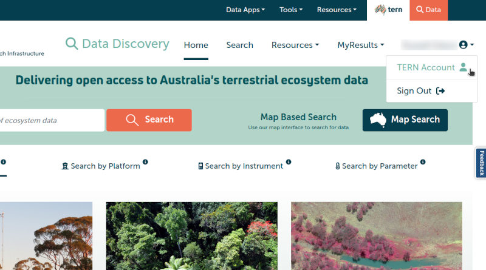
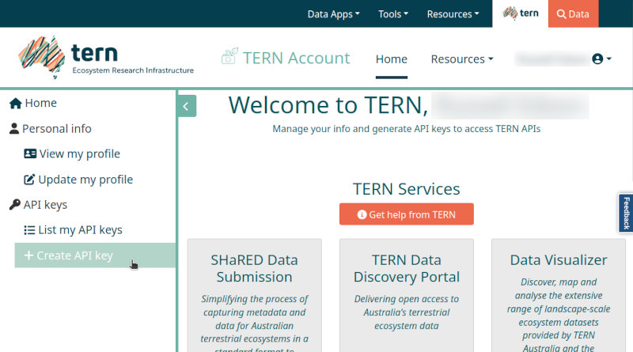
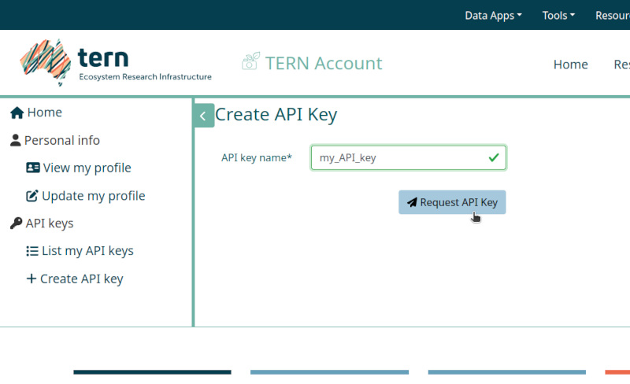
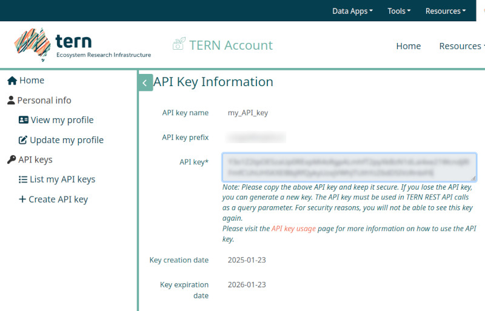
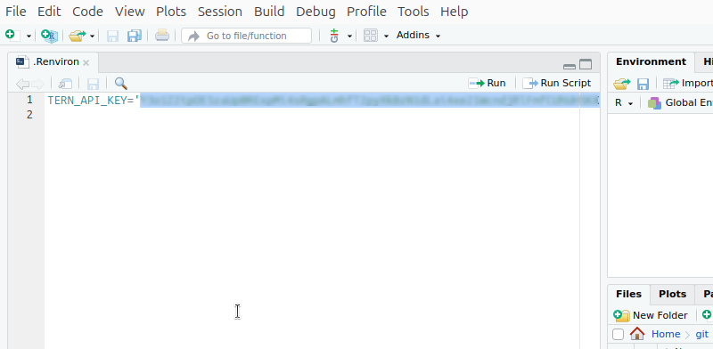
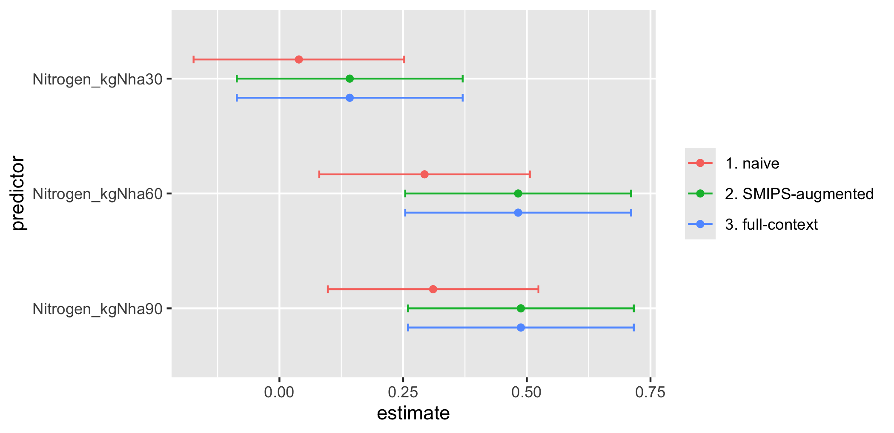

<<<<<<< HEAD
<<<<<<< HEAD
=======
>>>>>>> a6eff16 (Updated nert analytics vignette and fixed some typos in the nert.Rmd one too)
The **nert** package provides straightforward and seamless access to the TERN
Soil Moisture Integration and Prediction System (SMIPS) datasets, which
include soil moisture measures that can be included in your agricultural
data analytics to improve modelling efficacy. This document showcases this
process with the example of a synthesised multi-site grain
production experiment. The **nert** package is loaded and used to download
soil moisture time series data at various locations across South Australia,
and these are included as confounding variables to augment the analytics.
<<<<<<< HEAD
=======
This document introduces you to the **nert** package, including setup and
how to use the package to download SMIPS data for given locational coordinates
in Australia. The document then showcases an example of a grain production
experiment, and how we can use **nert** and the SMIPS soil moisture readings
to improve our analytics and modelling.

## Setup: Acquire and specify your TERN API key

An API key is required to access TERN datasets (including SMIPS) through 
their online data portal. The **nert** package streamlines the data process,
but still requires authorisation using an API key. However, it is
straightforward to sign up to the TERN Data Portal and acquire an API key that
you can use, and by setting it in your R environment (via `.Renviron`) you
can provide the **nert** package with that credential to allow convenient
access.

The following steps detail the process for signing in to your TERN account,
generating an API key, and storing it in your R environment:

1. Navigate to the TERN Data Discovery Portal (https://portal.tern.org.au/) in 
 a web browser, and click the "Sign in" button that appears in the top-right
 of the browser window.
 
    {width=80%}
    
1. Click the Australian Access Federation button to sign in to the TERN Data
    Portal via your University ID (or alternatively, sign in via CILogon or
    your Google identity).
 
    {width=80%}
    
1. Once signed in, click on the menu in the top-right with your name and click
    the "TERN Account" entry to open your account profile.
 
    {width=80%}
    
1. On your account profile screen, navigate to the menu on the left-hand side,
    and click the "Create API key" entry.
 
    {width=80%}
    
1. On this screen you can create your API key for accessing the TERN Data
    Portal. Give your key whatever name you like (e.g., below I have called
    the key "my_API_key" for demonstration purposes), and then click the
    "Request API Key" button.
 
    {width=80%}
    
1. Your API key is now generated and appears as the string of text inside the
    text box on the page, together with the key's creation and expiration
    dates. Copy the API key to your clipboard, so that we can paste it into
    the `.Renvion` file in the next step.
 
    {width=80%}
    
1. Open your `.Renviron` file (e.g., if you are using RStudio, an easy way to
    open the right file is to enter `usethis::edit_r_environ()`). Add a new
    line to the file to store your API key in the variable `TERN_API_KEY`:
    
    ```
    TERN_API_KEY='<paste your key here>'
    ```
 
    {width=80%}
    
1. Save your `.Renviron` file, and restart your R session so that the change is 
    applied. You can then test that the **nert** package is reading your API 
    key properly by entering `nert::get_key()` at the R command console. If the
    API key was successfully read by **nert**, then you should see your API key
    appear verbatim as output.
 
    {width=80%}

1. Finally, you can quickly test that the data download from the TERN portal 
    is working as intended by downloading a test data raster. The below code
    downloads the SMIPS "totalbucket" soil moisture data raster for January 1st
    2024, and uses the **terra** package's `extract` function to get a point 
    value for the soil moisture measurement at the Adelaide CBD (at 
    approximately -34.9285 decimal degrees latitude, 138.6007 longitude):
    
    ```{r testnertcache, include = FALSE}
library(nert)
adelaide <- readRDS("cache_adelaide.rds")
    ```
    
    ```{r testnert, eval = FALSE}
library(nert)
r <- read_smips(day = "2024-01-01")
terra::extract(r, xy = TRUE, data.frame(lon = 138.6007, lat = -34.9285))
    ```
    ```{r testnertresults, echo = FALSE}
adelaide
    ```

At this stage your **nert** package is now working, and you can use it to
easily download SMIPS datasets from the TERN Data Portal. The rest of this
vignette shows how you can use this downloaded soil moisture data to augment
analytics, using a fictitious grain production experiment as an illuminating
example.
>>>>>>> 55480d7 (Should fix Max's comments (hopefully) and fixes plot issue in vignette)
=======
>>>>>>> a6eff16 (Updated nert analytics vignette and fixed some typos in the nert.Rmd one too)

## A synthetic dataset for a grain production experiment

A simulated dataset containing yield data for a fictitious grain production
experiment has been included with the **nert** package. The dataset is
called `grain`, and you can load the package and this dataset with:


``` r
library(nert)
data(grain)
str(grain)
#> 'data.frame':	2880 obs. of  10 variables:
#>  $ Site             : Factor w/ 10 levels "Adelaide","Barossa Valley",..: 1 1 1 1 1 1 1 1 1 1 ...
#>  $ Latitude         : num  -34.9 -34.9 -34.9 -34.9 -34.9 ...
#>  $ Longitude        : num  139 139 139 139 139 ...
#>  $ SowDate          : Date, format: "2022-05-20" "2022-05-20" "2022-05-20" "2022-05-20" ...
#>  $ NitrogenDate     : Date, format: "2022-06-04" "2022-06-04" "2022-06-04" "2022-06-04" ...
#>  $ Rep              : Factor w/ 3 levels "1","2","3": 1 1 1 1 1 1 1 1 1 1 ...
#>  $ Variety          : Factor w/ 8 levels "Variety_A","Variety_B",..: 1 1 1 1 1 1 1 1 1 1 ...
#>  $ Nitrogen_kgNha   : Factor w/ 4 levels "0","30","60",..: 1 1 1 2 2 2 3 3 3 4 ...
#>  $ SeedRate_plantsm2: Factor w/ 3 levels "75","150","300": 1 2 3 1 2 3 1 2 3 1 ...
#>  $ Yield_Tha        : num  3 3.69 3.89 2.76 3.27 ...
```

The `grain` dataset supposes that a fabricated grain production experiment has
been run at a selection of ten sites across South Australia, looking at the
effects of four different treatment levels of Nitrogen application and three
different seeding rates on the grain yield for some crop with eight varieties.

Note that we have locational coordinates (in `Latitude` and
`Longitude`) for each of the sites, as well as dates for the crop sowing and
Nitrogen applications (in `SowDate` and `NitrogenDate` respectively.) This
spatiotemporal information is useful, as it allows us to match up the
experimental sites with the data points that we need to download from SMIPS.

## Download SMIPS data for the sites across times

Here we use the **nert** package to download SMIPS soil moisture datasets
from the TERN Data Portal, which we can use to augment our analysis of
the `grain` experiment data. The two key SMIPS datasets of interest are:

1. `totalbucket`: an estimate of the _volumetric soil moisture_ (in units of mm)
  from the SMIPS bucket moisture store,

1. `SMindex`: the SMIPS _soil moisture index_ (i.e., a number between 0 and 1
  that indicates how full the SMIPS bucket moisture store is relative to
  its 90cm capacity).

For simplicity, suppose we are interested in the SMIPS soil moisture index
(`SMindex`) data, for all days falling between the earliest Nitrogen
application date up to 30 days after the last application date, and we want the
soil moisture index at each site (by latitude/longitude coordinates). We can
generate this date range in a straightforward way using the `NitrogenDate`
column of the `grain` dataset as follows:

``` r
start_date <- min(grain$NitrogenDate)
end_date <- max(grain$NitrogenDate) + 30
date_range <- seq(start_date, end_date, by = "1 day")

c(date_range[1], date_range[length(date_range)])
#> [1] "2022-05-07" "2022-07-15"
```

We also need the latitude and longitude for the sites, which we can readily
retrieve from the `grain` dataset columns `Latitude` and `Longitude`:
<<<<<<< HEAD
<<<<<<< HEAD

``` r
=======
```{r siteslist}
>>>>>>> 55480d7 (Should fix Max's comments (hopefully) and fixes plot issue in vignette)
=======

``` r
>>>>>>> a6eff16 (Updated nert analytics vignette and fixed some typos in the nert.Rmd one too)
sites <- unique(grain[, c("Site", "Latitude", "Longitude")])
sites
#>                    Site  Latitude Longitude
#> 1              Adelaide -34.94773  138.6244
#> 289      Barossa Valley -34.54843  138.9580
#> 577        Clare Valley -33.83754  138.6012
#> 865      Eyre Peninsula -34.37378  135.7967
#> 1153 Fleurieu Peninsula -35.52307  138.4608
#> 1441    Kangaroo Island -35.71041  137.0736
#> 1729    Limestone Coast -37.88957  140.6388
#> 2017         Sturt Vale -33.34666  140.0723
#> 2305        Murraylands -35.12425  139.3014
#> 2593    Yorke Peninsula -35.05124  137.2090
```

Now TERN supplies the SMIPS daily data rasters as cloud-optimised GeoTIFFs
(or COGs), which contain the soil moisture point predictions across the
entirety of Australia. However, because they are cloud-optimised, we can be
clever in our downloading to make sure that we only download data for the
locations of interest, rather than the entire raster. The **nert** package works
in tandem with the **terra** package to achieve this efficiency:

- First, we download the _information_ for a daily SMIPS raster
    using `nert::read_smips`,
- Then we _extract only the point values we need_, using `terra::extract`.

This leads to a quicker and tighter data download. The below code shows
this process. (Note that `terra::extract` is particular about the order
of the latitude/longitude coordinates: longitude should be specified first,
followed by latitude.)


``` r
smips_data <- data.frame()
for (i in 1:length(date_range)) {
  r <- read_smips(collection = "SMindex", day = date_range[i])
  smips_points <- terra::extract(
    x = r,
    y = data.frame(lon = sites$Longitude, lat = sites$Latitude),
    xy = TRUE
  )
  names(smips_points)[2] <- "smips_smi_perc"

  smips_data <- rbind(
    smips_data,
    data.frame(
      Date = date_range[i],
      Latitude = smips_points$y,
      Longitude = smips_points$x,
      smips_smi_perc = smips_points$smips_smi_perc
    )
  )
}
head(smips_data)
#>         Date  Latitude Longitude smips_smi_perc
#> 1 2022-05-07 -34.95253  138.6237     0.25906488
#> 2 2022-05-07 -34.55264  138.9537     0.17677850
#> 3 2022-05-07 -33.83285  138.6037     0.07674548
#> 4 2022-05-07 -34.37270  135.7944     0.53408158
#> 5 2022-05-07 -35.52237  138.4638     0.37496096
#> 6 2022-05-07 -35.71231  137.0741     0.30223876
```

We can add the `Site` column to the `smips_data` to make it easier to use it
in conjunction with the `grain` dataset during the analysis:


``` r
smips_data$Site <- sites$Site
head(smips_data)
#>         Date  Latitude Longitude smips_smi_perc               Site
#> 1 2022-05-07 -34.95253  138.6237     0.25906488           Adelaide
#> 2 2022-05-07 -34.55264  138.9537     0.17677850     Barossa Valley
#> 3 2022-05-07 -33.83285  138.6037     0.07674548       Clare Valley
#> 4 2022-05-07 -34.37270  135.7944     0.53408158     Eyre Peninsula
#> 5 2022-05-07 -35.52237  138.4638     0.37496096 Fleurieu Peninsula
#> 6 2022-05-07 -35.71231  137.0741     0.30223876    Kangaroo Island
```

We are now ready to proceed with the analytics.

## A simple model for grain yield

First, we model the grain yield with a simple model without taking into account
any soil moisture confounding---that is, without reference to the SMIPS data
that we have just downloaded. We will later incorporate the SMIPS data to see
how including the soil moisture as a covariate improves the modelling.

Here we will use the **nlme** package to fit a linear mixed-effect model. The
grain yield `Yield_tha` will be modelled taking the `Variety`, Nitrogen
application rate `Nitrogen_kgNha` and seeding rate `SeedRate_plantsm2` as fixed
terms, and incorporating the `Site` and replicate (`Rep`) structure of the
experiment in a random effect term.


``` r
library(nlme)
simple_model <- lme(
  fixed = Yield_Tha ~ Variety * Nitrogen_kgNha * SeedRate_plantsm2,
  random = ~ 1 | Site / Rep,
  data = grain
)
```

We can check the confidence intervals for the effect sizes of the
Nitrogen treatments for this simple model:

``` r
simple_model.ints <- intervals(simple_model, which = "fixed")$fixed
simple_model.Neffects <- simple_model.ints[paste0("Nitrogen_kgNha", c(30, 60, 90)), ]
simple_model.Neffects
#>                        lower      est.     upper
#> Nitrogen_kgNha30 -0.17355028 0.0392950 0.2521403
#> Nitrogen_kgNha60  0.08045472 0.2933000 0.5061453
#> Nitrogen_kgNha90  0.09779306 0.3106383 0.5234836
```

## Augment the yield model with soil moisture data

Next, we augment our modelling by including the SMIPS soil moisture data
as a covariate (perhaps anticipating that the soil moisture improves the
yield, but might reduce the effect of Nitrogen applied to the soil due
to volatilisation). To keep things simple, for each site (and its
associated Nitrogen application date) we take an average of the SMIPS-reported
soil moisture index from the date of the Nitrogen application until 30 days
after the application, which we will store in a new column called
`SoilMoisture_avg`.


``` r
for (site in sites$Site) {
  start_date <- unique(grain[which(grain$Site == site), "NitrogenDate"])[1]
  dates <- seq(start_date, start_date + 30, by = "1 day")
  smips <- smips_data[which(smips_data$Site == site & smips_data$Date %in% dates), ]
  smips_avg <- mean(smips[["smips_smi_perc"]])
  grain[which(grain$Site == site), "SoilMoisture_avg"] <- smips_avg
}
```

We can then add this average soil moisture as a fixed effect to the linear
mixed-effect model:


``` r
augmented_model <- lme(
  fixed = Yield_Tha ~ Variety * Nitrogen_kgNha * SeedRate_plantsm2
    + SoilMoisture_avg + SoilMoisture_avg:Nitrogen_kgNha,
  random = ~ 1 | Site / Rep,
  data = grain
)
```

The confidence intervals for the effect sizes of the Nitrogen application
treatments for this augmented model are then as follows:


``` r
augmented_model.ints <- intervals(augmented_model, which = "fixed")$fixed
augmented_model.Neffects <- augmented_model.ints[paste0("Nitrogen_kgNha", c(30, 60, 90)), ]
augmented_model.Neffects
#>                        lower      est.     upper
#> Nitrogen_kgNha30 -0.03984861 0.2000454 0.4399395
#> Nitrogen_kgNha60  0.31409573 0.5539898 0.7938838
#> Nitrogen_kgNha90  0.33961765 0.5795117 0.8194058
```

We can use **ggplot2** plotting to graph the confidence intervals for the
simple model versus the augmented model, and illuminate the difference
attained when we include the soil moisture as a confounding term in our
modelling:


``` r
library(ggplot2)

ci <- rbind(
  data.frame(simple_model.Neffects, model = "Simple Model"),
  data.frame(augmented_model.Neffects, model = "SMIPS-Augmented Model")
)
ci$term <- paste0("Nitrogen_kgNha", c(30, 60, 90))

pd <- position_dodge(0.4)
ggplot(ci, aes(x = est., y = term, colour = model)) +
  geom_point(position = pd) +
  geom_errorbarh(aes(xmin = lower, xmax = upper), position = pd, height = 0.2) +
  labs(y = "predictor", x = "estimate")
```

<div class="figure" style="text-align: center">

<p class="caption">Nitrogen effect estimates compared between the simple model and
  the SMIPS-augmented model.</p>
</div>

From the comparison of the effect sizes for the Nitrogen treatment, we can
see that the simple model underestimates the treatment effect. The
augmented model, in contrast, accounts for the soil moisture and the potential
Nitrogen vaporisation that may occur in high soil moisture conditions.
=======
---

```{r, include = FALSE}
knitr::opts_chunk$set(collapse = TRUE, comment = "#>")
```

The TERN Soil Moisture Integration and Prediction System (SMIPS) generates
useful measurements of soil moisture at 1km resolution across all of Australia.
TERN provides this soil moisture information as packaged daily datasets [via
their TERN Data Portal](https://data.tern.org.au/model-derived/smips/), in
cloud-optimised GeoTIFF format. The **nert** package provides ease of access
to these SMIPS datasets for use and inclusion in R data analytics workflows.

This document introduces you to the **nert** package, including setup and
how to use the package to download SMIPS data for given locational coordinates
in Australia. The document then showcases an example of a grain production
experiment, and how we can use **nert** and the SMIPS soil moisture readings
to improve our analytics and modelling.

TODO: below. Vignette is a work-in-progress.

## Setup: Acquire and link your TERN API key

details and screenshots for this here. 

At end: include a quick example of how to
grab the data similar to what Adam had in the readme (e.g., just download
data for Adelaide CBD or something and show how it appears in the data frame).

```{r setup}
library(nert)

# ...
```


## A synthetic dataset for a grain production experiment

details here. Just create the data here and include as a (properly documented)
dataset in /data, but briefly summarise here the
method for how it was created as per Max's email.

Final paragraph: draw attention to the sites and their lat/long coordinates,
this leads nicely into the next bit.

## Download SMIPS data for the sites across times

detail + code for that here, mostly as it appears in the files Max sent in
the emails. Add comments, and note that we are using the
percentage dataset (i.e., SMIndex) rather than the totalbucket (check with 
Max: is this the best way? Do things change too much for the worse if we
just use the default totalbucket?)

## A simple model for grain yield

The first model, without SMIPS. Include Max's DAGs (as jpgs?) as figures. As
per the email Max sent.

## Augment the yield model with soil moisture data

The second model, including the SMIPS soil moisture as a confounder. As per
Max's email, we perhaps expect phenomenologically that soil moisture improves 
yield, but reduces the effect of Nitrogen in the soil due to volatilisation.
modeling shows that this is the case.
>>>>>>> e678c24 (Start putting the vignette together in between analyses this week)
