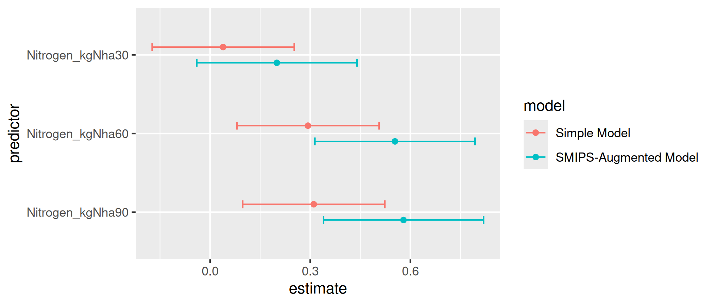

<!-- STOP! Do not edit this file. This file is generated from nert_for_agricultural_analytics.Rmd.orig -->


## Why augment a designed experiment with TERN?

A multi-site agricultural trial randomises over treatments at each site, but
not over the soil and water conditions that pre-define how each paddock
responds to those treatments. Two paddocks given the same nitrogen rate can
return very different yields — partly genuine site effect, partly structural
variation in soil texture, water-holding capacity, pH, and antecedent
moisture that the experimental design did not control. **nert** lets you pull
the relevant structural covariates from the **TERN** portal in a single call,
moving them out of "site effect" and into named terms in the model.

This vignette walks through that augmentation on the synthetic `grain`
dataset shipped with the package, comparing three nested models of nitrogen
response: a naive baseline, a moisture-augmented model, and a
full-soil-context model that adds three static SLGA covariates.

## The trial: ten South Australian sites, four nitrogen rates

`grain` is a fabricated multi-site experiment across ten sites in
South Australia: three replicates each, eight wheat varieties, four nitrogen
application rates, and three seeding rates. Each site has its own sowing date
and nitrogen-application date.


``` r
library(nert)
data(grain)
str(grain)
#> 'data.frame':	2880 obs. of  10 variables:
#>  $ Site             : Factor w/ 10 levels "Adelaide","Barossa Valley",..: 1 1 1 1 1 1 1 1 1 1 ...
#>  $ Latitude         : num  -34.9 -34.9 -34.9 -34.9 -34.9 ...
#>  $ Longitude        : num  139 139 139 139 139 ...
#>  $ SowDate          : Date, format: "2022-05-20" "2022-05-20" ...
#>  $ NitrogenDate     : Date, format: "2022-06-04" "2022-06-04" ...
#>  $ Rep              : Factor w/ 3 levels "1","2","3": 1 1 1 1 1 1 1 1 1 1 ...
#>  $ Variety          : Factor w/ 8 levels "Variety_A","Variety_B",..: 1 1 1 1 1 1 1 1 1 1 ...
#>  $ Nitrogen_kgNha   : Factor w/ 4 levels "0","30","60",..: 1 1 1 2 2 2 3 3 3 4 ...
#>  $ SeedRate_plantsm2: Factor w/ 3 levels "75","150","300": 1 2 3 1 2 3 1 2 3 1 ...
#>  $ Yield_Tha        : num  3 3.69 3.89 2.76 3.27 ...
```


``` r
sites <- unique(grain[, c("Site", "Latitude", "Longitude", "NitrogenDate")])
sites
#>                    Site  Latitude Longitude NitrogenDate
#> 1              Adelaide -34.94773  138.6244   2022-06-04
#> 289      Barossa Valley -34.54843  138.9580   2022-05-19
#> 577        Clare Valley -33.83754  138.6012   2022-05-18
#> 865      Eyre Peninsula -34.37378  135.7967   2022-05-07
#> 1153 Fleurieu Peninsula -35.52307  138.4608   2022-06-15
#> 1441    Kangaroo Island -35.71041  137.0736   2022-06-10
#> 1729    Limestone Coast -37.88957  140.6388   2022-05-18
#> 2017         Sturt Vale -33.34666  140.0723   2022-05-29
#> 2305        Murraylands -35.12425  139.3014   2022-05-30
#> 2593    Yorke Peninsula -35.05124  137.2090   2022-05-31
```

## Pulling the TERN covariates with one call

The agronomic story we want to test is straightforward: *the nitrogen
treatment effect is conditional on (i) how much water the soil can hold,
(ii) how much clay is at the surface, (iii) the soil's pH, and (iv) what the
actual soil moisture was during the two weeks immediately after the
fertiliser was surface-applied.* The first three are static SLGA properties;
the fourth is daily SMIPS time-series data.

`collect_tern_data()` retrieves multiple datasets at multiple coordinates in
one call. Static covariates are returned once per location; time-series
covariates are returned once per location-day pair. We pull the three static
SLGA covariates first — one call covers all ten sites:


``` r
sites_xy <- data.frame(lon = sites$Longitude, lat = sites$Latitude)

tern_static <- collect_tern_data(
  xy         = sites_xy,
  date_range = "2024-01-01",          # arbitrary — SLGA layers are static
  datasets   = c("AWC", "CLY", "PHC"),
  depth      = "000_005",             # surface 0–5 cm
  verbose    = FALSE
)
tern_static$Site <- sites$Site
tern_static
#>           date      lon       lat   AWC   CLY   PHC               Site
#>         <Date>    <num>     <num> <num> <num> <num>             <fctr>
#>  1: 2024-01-01 138.6244 -34.94773    14     8  6.58           Adelaide
#>  2: 2024-01-01 138.9580 -34.54843    13    16  6.05     Barossa Valley
#>  3: 2024-01-01 138.6012 -33.83754    14    14  5.24       Clare Valley
#>  4: 2024-01-01 135.7967 -34.37378    14    12  5.53     Eyre Peninsula
#>  5: 2024-01-01 138.4608 -35.52307    15    15  5.26 Fleurieu Peninsula
#>  6: 2024-01-01 137.0736 -35.71041    15    11  5.04    Kangaroo Island
#>  7: 2024-01-01 140.6388 -37.88957    14    17  6.45    Limestone Coast
#>  8: 2024-01-01 140.0723 -33.34666    14    10  7.12         Sturt Vale
#>  9: 2024-01-01 139.3014 -35.12425    15    11  6.42        Murraylands
#> 10: 2024-01-01 137.2090 -35.05124    15     7  6.67    Yorke Peninsula
```

Then daily SMIPS soil moisture index for the 14 days after each site's
nitrogen application — looped per-site so we only fetch dates that matter
for that site:


``` r
smips_per_site <- lapply(seq_len(nrow(sites)), function(i) {
  ndt <- as.Date(sites$NitrogenDate[i])
  d   <- collect_tern_data(
    lon              = sites$Longitude[i],
    lat              = sites$Latitude[i],
    date_range       = seq(ndt, ndt + 14, by = "day"),
    datasets         = "SMIPS",
    smips_collection = "SMindex",
    verbose          = FALSE
  )
  d$Site <- sites$Site[i]
  d
})
smips_data <- do.call(rbind, smips_per_site)
head(smips_data)
#>          date SMIPS_SMindex     Site
#>        <Date>         <num>   <fctr>
#> 1: 2022-06-04     0.9668998 Adelaide
#> 2: 2022-06-05     0.9848897 Adelaide
#> 3: 2022-06-06     0.9855008 Adelaide
#> 4: 2022-06-07     0.9954585 Adelaide
#> 5: 2022-06-08     0.9717203 Adelaide
#> 6: 2022-06-09     1.0000000 Adelaide
```

Per-site summary — the post-fertiliser two-week mean soil moisture index:


``` r
smips_avg <- aggregate(SMIPS_SMindex ~ Site, smips_data, mean)
names(smips_avg)[2] <- "SoilMoisture_avg"
smips_avg
#>                  Site SoilMoisture_avg
#> 1            Adelaide        0.9455443
#> 2      Barossa Valley        0.3613278
#> 3        Clare Valley        0.1580657
#> 4      Eyre Peninsula        0.4677562
#> 5  Fleurieu Peninsula        0.9551311
#> 6     Kangaroo Island        0.9200731
#> 7     Limestone Coast        0.8000182
#> 8         Murraylands        0.3454282
#> 9          Sturt Vale        0.2014647
#> 10    Yorke Peninsula        0.8654230
```

Join the four covariates back to `grain`:


``` r
grain <- merge(grain, tern_static[, c("Site", "AWC", "CLY", "PHC")], by = "Site")
grain <- merge(grain, smips_avg, by = "Site")
str(grain[, c("Site", "AWC", "CLY", "PHC", "SoilMoisture_avg")])
#> 'data.frame':	2880 obs. of  5 variables:
#>  $ Site            : Factor w/ 10 levels "Adelaide","Barossa Valley",..: 1 1 1 1 1 1 1 1 1 1 ...
#>  $ AWC             : num  14 14 14 14 14 14 14 14 14 14 ...
#>  $ CLY             : num  8 8 8 8 8 8 8 8 8 8 ...
#>  $ PHC             : num  6.58 6.58 6.58 6.58 6.58 ...
#>  $ SoilMoisture_avg: num  0.946 0.946 0.946 0.946 0.946 ...
```

## Three nested models of nitrogen response

We fit a linear mixed-effect model of grain yield, with site and replicate as
random effects, and progressively richer fixed-effect structures.

**Model 1 — naive.** Variety × nitrogen × seed-rate, nothing about soil or
moisture.


``` r
library(nlme)
model1 <- lme(
  fixed  = Yield_Tha ~ Variety * Nitrogen_kgNha * SeedRate_plantsm2,
  random = ~ 1 | Site / Rep,
  data   = grain
)
```

**Model 2 — SMIPS-augmented.** Adds the post-fertiliser soil moisture
average and its interaction with nitrogen rate (anticipating moisture-driven
volatilisation losses).


``` r
model2 <- lme(
  fixed  = Yield_Tha ~ Variety * Nitrogen_kgNha * SeedRate_plantsm2
                      + SoilMoisture_avg
                      + SoilMoisture_avg:Nitrogen_kgNha,
  random = ~ 1 | Site / Rep,
  data   = grain
)
```

**Model 3 — full-context.** Adds the three static SLGA covariates that
pre-determine each paddock's water and nutrient retention.


``` r
model3 <- lme(
  fixed  = Yield_Tha ~ Variety * Nitrogen_kgNha * SeedRate_plantsm2
                      + SoilMoisture_avg
                      + SoilMoisture_avg:Nitrogen_kgNha
                      + AWC + CLY + PHC,
  random = ~ 1 | Site / Rep,
  data   = grain
)
```

Extract the nitrogen-rate effect intervals from each:


``` r
n_terms <- paste0("Nitrogen_kgNha", c(30, 60, 90))

n_effects <- function(m, label) {
  ints <- intervals(m, which = "fixed")$fixed
  data.frame(ints[n_terms, ], term = n_terms, model = label)
}

ci <- rbind(
  n_effects(model1, "1. naive"),
  n_effects(model2, "2. SMIPS-augmented"),
  n_effects(model3, "3. full-context")
)
ci
#>                         lower      est.     upper             term
#> Nitrogen_kgNha30  -0.17355028 0.0392950 0.2521403 Nitrogen_kgNha30
#> Nitrogen_kgNha60   0.08045472 0.2933000 0.5061453 Nitrogen_kgNha60
#> Nitrogen_kgNha90   0.09779306 0.3106383 0.5234836 Nitrogen_kgNha90
#> Nitrogen_kgNha301 -0.08611432 0.1421120 0.3703383 Nitrogen_kgNha30
#> Nitrogen_kgNha601  0.25425447 0.4824808 0.7107071 Nitrogen_kgNha60
#> Nitrogen_kgNha901  0.25976736 0.4879937 0.7162200 Nitrogen_kgNha90
#> Nitrogen_kgNha302 -0.08611432 0.1421120 0.3703383 Nitrogen_kgNha30
#> Nitrogen_kgNha602  0.25425447 0.4824808 0.7107071 Nitrogen_kgNha60
#> Nitrogen_kgNha902  0.25976736 0.4879937 0.7162200 Nitrogen_kgNha90
#>                                model
#> Nitrogen_kgNha30            1. naive
#> Nitrogen_kgNha60            1. naive
#> Nitrogen_kgNha90            1. naive
#> Nitrogen_kgNha301 2. SMIPS-augmented
#> Nitrogen_kgNha601 2. SMIPS-augmented
#> Nitrogen_kgNha901 2. SMIPS-augmented
#> Nitrogen_kgNha302    3. full-context
#> Nitrogen_kgNha602    3. full-context
#> Nitrogen_kgNha902    3. full-context
```

## Comparing the nitrogen effect


``` r
library(ggplot2)

pd <- position_dodge(-0.5)
ggplot(ci, aes(x = est., y = term, colour = model)) +
  scale_y_discrete(limits = rev) +
  geom_point(position = pd) +
  geom_errorbarh(aes(xmin = lower, xmax = upper), position = pd, height = 0.2) +
  labs(y = "predictor", x = "estimate", colour = NULL)
```

<div class="figure" style="text-align: center">

<p class="caption">Nitrogen effect estimates across three nested models. Each
  augmentation tightens the confidence interval by moving structural
  variation from the random site effect into named covariates.</p>
</div>

## What changed and why

Each augmentation tightens the nitrogen effect by moving structural
variation out of the unnamed random site effect and into named covariates:

- **Model 1 → 2**: SMIPS reveals that some paddocks were wetter than others
  in the two weeks after fertiliser was surface-applied; that drives
  volatilisation losses and dilutes the apparent nitrogen response.
- **Model 2 → 3**: AWC, surface clay, and pH explain *why* certain sites
  retain water and nutrients differently in the first place — pre-existing
  structural conditions that the random site effect was previously absorbing.

The full-context model is the most defensible: residual variation is now
genuine experimental error rather than confounded soil and moisture
structure. The same pattern composes for any **nert**-supported variable —
canopy height, evapotranspiration, phenology, soil beta-diversity — and
scales to any number of sites and dates with a single `collect_tern_data()`
call.

## See also

If your analysis crosses multiple Australian data sources rather than only
TERN, **fifo** (`https://codeberg.org/adamhsparks/fifo`) provides a unified
`xy`-based extractor that calls **nert** for TERN, **read.abares** for
ABARES regions and topsoil layers, **weatherOz** for SILO and DPIRD weather,
plus its own GRDC Agroecoregions and DAAS Soil Atlas layers. **nert** stays
the right choice when you need raw TERN rasters or the full set of TERN
variables; **fifo** is the right choice when you want one `xy` query to
return TERN, weather, and tenure data side-by-side.
